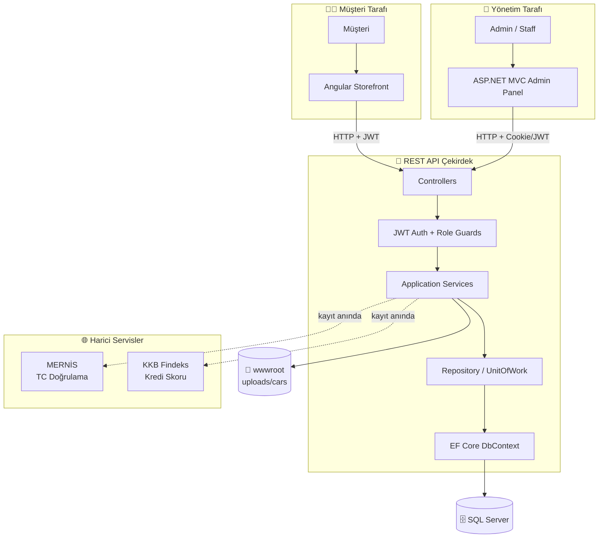
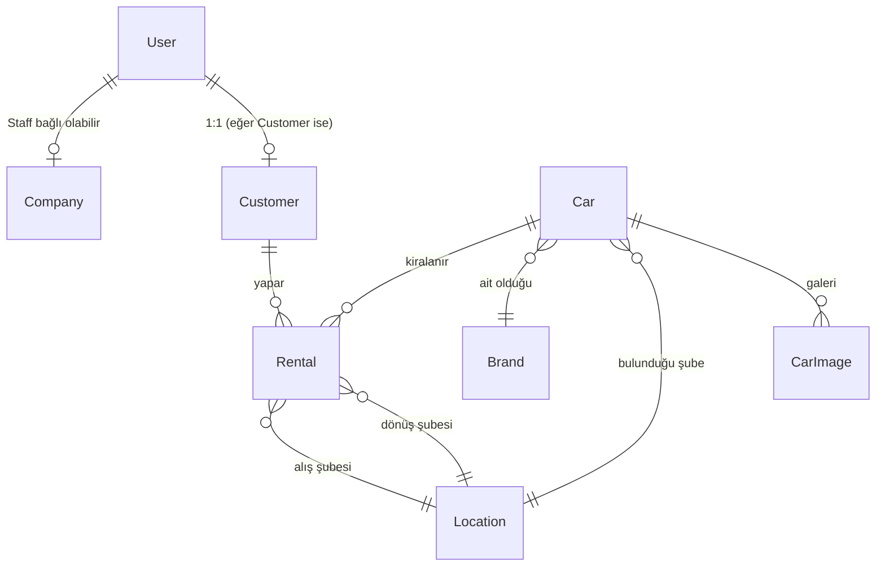

# 🚗 RentACar — Full Stack Araç Kiralama & Filo Yönetim Platformu

> **REST API çekirdekli, çok katmanlı (Clean / Layered Architecture)** araç kiralama sistemi.
> Admin Panel ve Angular Storefront yalnızca **REST API** üzerinden veriye erişir; doğrudan veritabanı bağlantısı yoktur.

---

## 🎯 Proje Amacı

Bu proje, kurumsal düzeyde bir **araç kiralama ve filo yönetim sistemini** uçtan uca geliştirmek üzerine kurgulanmıştır:

- **REST API** üzerinden tüm operasyonların yönetildiği merkezi çekirdek
- **Admin Panel** ile filo, kiralama ve müşteri yönetimi
- **Angular Storefront** ile uçtan uca müşteri rezervasyon deneyimi
- Modern yazılım standartları: JWT, Role-Based Authorization, AutoMapper, EF Core, Swagger, Global Exception Handling, MERNİS Doğrulama

---

## 🧩 Genel Bakış

Proje üç ana bileşenden oluşur:

| Bileşen | Görev |
|---|---|
| **REST API** | Sistemin çekirdeği — tüm iş kuralları ve veri kapısı |
| **Admin Panel** | Filo yönetimi, kiralama onayı, kullanıcı/şube/marka yönetimi |
| **Angular Client** | Müşterinin araç aradığı, rezervasyon yaptığı storefront |

📌 **Tek veri kapısı REST API'dir.** Admin Panel ve Angular Client doğrudan veritabanına bağlanmaz.

---

## 🔄 İş Akışı (System Flow)



---

## 🧠 Mimari — Clean / Layered Architecture

```
RentACar/
├── src/
│   ├── Core/
│   │   ├── RentACar.Domain/              → Entity'ler, Enum'lar, Domain Interfaces
│   │   │   ├── Entities/                 → Car, Brand, Rental, User, Customer...
│   │   │   └── Interfaces/               → ICarRepository, IUnitOfWork...
│   │   │
│   │   └── RentACar.Application/         → İş kuralları, DTO, Mapping, JWT
│   │       ├── DTOs/                     → CarCreateDto, RentalDto, AuthResponseDto...
│   │       ├── Interfaces/               → ICarService, IAuthService...
│   │       ├── Helpers/                  → JwtTokenHelper, PasswordHasher
│   │       └── Mappings/                 → AutoMapper Profiles
│   │
│   ├── Infrastructure/
│   │   └── RentACar.Infrastructure/      → EF Core, Repository, Servis Implementation
│   │       ├── Data/                     → AppDbContext
│   │       ├── Migrations/
│   │       ├── Repositories/             → GenericRepository, CarRepository, UnitOfWork
│   │       └── Services/                 → CarService, RentalService, MernisService...
│   │
│   └── Presentation/
│       └── RentACar.RestApi/             → REST endpoint'leri
│           ├── Controllers/
│           ├── Middleware/               → GlobalExceptionHandler
│           ├── Authorization/            → CompanyDataIsolationHandler
│           └── Program.cs
│
├── RentACar.AdminPanel/                  → ASP.NET Core MVC (UI)
│   ├── Controllers/                      → CarController, AuthController...
│   ├── Models/                           → ViewModels
│   ├── Services/                         → BaseApiService (HttpClient wrapper)
│   ├── Views/                            → Razor View'lar
│   └── wwwroot/                          → admin.css, admin.js
│
└── RentACar.ClientApp/                   → Angular Storefront
    └── src/app/
        ├── core/                         → Auth, Guards, Interceptors, API Services
        ├── features/                     → Cars, Rentals, Profile, Cart
        ├── shared/                       → Pipe, Component, Directive
        └── layout/                       → Header, Footer, Shell
```

### Katmanların Sorumlulukları

| Katman | Sorumluluk |
|---|---|
| **Domain** | İş kuralları, entity modelleri, en saf katman — bağımlılık almaz |
| **Application** | Use-case akışları, DTO sözleşmeleri, mapping profilleri, "ne yapılacak?" |
| **Infrastructure** | EF Core, Repository, harici servis implementasyonları, "nasıl yapılacak?" |
| **Presentation** | HTTP endpoint'ler, Auth/Filter/Middleware — istemcilerin tek giriş kapısı |

---

## 🔐 Kimlik Doğrulama & Güvenlik

### REST API
- **JWT Authentication** (HMAC-SHA256, ayarlanabilir süre)
- **Role-Based Authorization**: `Admin`, `CompanyManager`, `Staff`, `Customer`
- **CompanyDataIsolationHandler** policy → multi-tenant veri izolasyonu (şirketler birbirinin verisini göremez)
- **Global Exception Handling Middleware** + Logging
- Swagger UI'da JWT token desteği

### Admin Panel
- **Cookie tabanlı authentication** (`CookieAuthenticationDefaults`)
- JWT token MVC tarafında parse edilip `ClaimsIdentity`'ye dönüştürülür → `[Authorize(Roles="Admin")]` çalışır
- API çağrılarında JWT, Cookie'den okunup `Authorization` header'ına eklenir
- Anti-Forgery Token korumalı formlar

### Angular
- JWT login flow
- Auth Guard + Role Guard
- HTTP Interceptor (token ekleme + global error handling)

### Hassas Veri Koruma
- Şifreler **BCrypt** ile hash'lenir
- TC kimlik no log'larda **maskeli** gözükür (`123*****456`)
- Soft delete yaklaşımı — veri silinmez, `IsDeleted=true` işaretlenir

---

## 🏛️ MERNİS & Findeks Entegrasyonu

### MERNİS TC Kimlik Doğrulama
- **Resmi NVİ algoritması**: 11 hane, kontrol basamakları (10. ve 11. digit)
- Müşteri kayıt anında TC No, Ad, Soyad ve Doğum Yılı doğrulanır
- > ⚠️ NVİ'nin ücretsiz `KPSPublic.asmx` servisi 30.09.2025'te kamu kullanımına kapatıldığından, servis **kurumsal entegrasyona hazır interface** ile geliştirilmiştir. KPS Kurumsal üyeliği alındığında tek implementasyon değişikliğiyle production'a hazır hale gelir.

### KKB Findeks Skoru
- Müşteri kayıt anında simülasyon servisinden kredi skoru çekilir
- Araç kiralama esnasında müşterinin Findeks puanı, aracın **MinFindeksScore** değeriyle karşılaştırılır
- Yetersizse rezervasyon reddedilir

---

## 🧩 Modüller & Özellikler

### 🌐 REST API
| Endpoint | İşlevsellik |
|---|---|
| **Auth** | Login, RegisterCompany, RegisterCustomer (MERNİS+Findeks), ChangePassword |
| **Car** | Paged List, GetById, Create, Update, Delete (resim upload dahil) |
| **Brand** | Paged + All + CRUD |
| **Location** | Paged + All + CRUD (şubeler) |
| **Rental** | Create, Approve, Complete, MyRentals (state-machine) |
| **AdditionalService** | CRUD (bebek koltuğu, navigasyon vb.) |
| **User** | Paged, AssignRole, UpdateProfile |
| **Dashboard** | Stats endpoint (toplam araç/aktif kira/bekleyen rezervasyon/müşteri) |

#### Standart Response Formatı
```json
{
  "data": { },
  "success": true,
  "message": "İşlem başarılı."
}
```

### 👔 Admin Panel
- 📊 **Dashboard** — Toplam araç, aktif kiralama, bekleyen rezervasyon, müşteri sayısı
- 🚗 **Araç Yönetimi** — Listeleme, ekleme, güncelleme, silme + **drag-drop resim upload**, **Excel export** (ClosedXML)
- 🏷️ **Marka Yönetimi** — CRUD
- 📍 **Şube Yönetimi** — CRUD
- 📄 **Kiralama Yönetimi** — Pending → Approved → Completed state machine
- 👥 **Kullanıcı & Rol Yönetimi**
- ➕ **Ek Hizmet Yönetimi**
- 🌓 **Dark/Light Theme Toggle**
- 📱 **Responsive Sidebar** (mini mode + tooltip)

### 📱 Angular Storefront
- Anasayfa + slider
- Şube + Tarih bazlı **müsait araç arama** (overlap algoritması ile)
- Araç detay ve özellikler
- Müşteri kayıt & giriş (JWT)
- Profil & sürüş geçmişi
- Rezervasyon oluşturma + ek hizmet seçimi
- Sipariş geçmişi
- 404 / 500 hata sayfaları

---

## 🧮 Müsaitlik Algoritması (Core Business Logic)

Araç müsaitlik kontrolü **çakışma (overlap) algoritması** ile yapılır:

```
Çakışma var mı? = (Mevcut.RentStartDate ≤ İstenen.DropOffDate)
                 AND (Mevcut.RentEndDate ≥ İstenen.PickUpDate)
```

Ek filtreler: aracın istenen şubede olması, `Bakımda` veya `Pasif` durumunda olmaması, `Cancelled` rezervasyonların hesaba katılmaması.

---

## ⚙️ Kullanılan Teknolojiler

| Katman | Teknoloji |
|---|---|
| **REST API** | ASP.NET Core 9 Web API, EF Core, AutoMapper, Swagger, JWT Bearer |
| **Admin Panel** | ASP.NET Core MVC, Razor, Bootstrap-style custom CSS, jQuery, Toastr, ClosedXML |
| **Storefront** | Angular, RxJS, Guards, Interceptors, Lazy Loading |
| **Database** | SQL Server (LocalDB) |
| **Auth** | JWT (API) + Cookie (MVC) hibrit yaklaşımı |
| **Şifreleme** | BCrypt.Net |
| **Logging** | Serilog (Console + File) |
| **External** | MERNİS algoritması, Findeks simülasyon servisi |

---

## 🚀 Kurulum & Çalıştırma

### Önkoşullar
- .NET 9 SDK
- SQL Server (LocalDB veya tam sürüm)
- Node.js 20+ (Angular için)

### 1️⃣ REST API
```bash
git clone https://github.com/<tubanursmsk>/RentACar.git
cd RentACar/src/Presentation/RentACar.RestApi

dotnet restore
dotnet ef database update --project ../../Infrastructure/RentACar.Infrastructure
dotnet run
```
🌐 Swagger: `http://localhost:5065`

### 2️⃣ Admin Panel
```bash
cd RentACar/RentACar.AdminPanel
dotnet run
```
🌐 Panel: `http://localhost:5048`

### 3️⃣ Angular Client
```bash
cd RentACar/RentACar.ClientApp
npm install
ng serve
```
🌐 Storefront: `http://localhost:4200`

### 📁 Dosya Yükleme Klasörleri
REST API ilk açılışta `wwwroot/images/cars/` klasörünü otomatik oluşturur. Yüklenen araç resimleri burada saklanır ve `Access-Control-Allow-Origin: *` başlığıyla servis edilir.

---

## 🗂️ Veritabanı Diyagramı



---

## 🎓 Öğrenme Kazanımları

- Clean / Layered Architecture'ı **gerçek bir proje** üzerinde uygulama
- REST API + Admin Panel + Angular istemci için **JWT/Cookie hibrit auth** kurma
- Multi-tenant veri izolasyonu (Custom AuthorizationHandler)
- State-machine pattern (rezervasyon durum geçişleri)
- Overlap algoritması ile müsaitlik kontrolü
- Drag-drop file upload + Multipart/form-data with HttpClient
- Resmi MERNİS algoritmasının uygulanması
- Global exception handling + structured logging
- Soft delete + audit fields (CreatedDate, UpdatedDate, IsDeleted)

---

## 📸 Ekran Görüntüleri

> ### Swagger — REST API Dokümantasyonu


> ### Admin Panel — Dashboard


> ### Admin Panel — Araç Yönetimi (Listeleme, Ekleme, Resim Upload)


> ### Admin Panel — Kiralama Yönetimi


> ### Angular Client — Storefront


[Macbook-Air-localhost-z4vhzexz0nl3h_.webm](https://github.com/user-attachments/assets/a418306a-5455-4b47-bb3e-de957e29da3c)

[Macbook-Air-localhost-h0smbfn2gkr2op.webm](https://github.com/user-attachments/assets/34b791e1-948b-4fe2-b9aa-3c2c9b137753)

[Macbook-Air-localhost-dadlxgq4za0lp4.webm](https://github.com/user-attachments/assets/417541da-7a65-4ac8-b47c-a69657b63251)

---

## 👩‍💻 Geliştirici

**Tuba Şimşek** — Software Developer

```bash
🔗 GitHub: https://github.com/tubanursmsk
```

---

## 🧾 Lisans

MIT License © 2026

---

## 🏷️ Etiketler

`ASP.NET Core 9` `EF Core` `Clean Architecture` `Layered Architecture`
`JWT` `Cookie Auth` `Role-Based Authorization` `Multi-Tenant`
`AutoMapper` `Repository Pattern` `Unit of Work` `BCrypt`
`Angular` `Bootstrap` `MERNİS` `Findeks` `Swagger`
`SQL Server` `Serilog` `RentACar` `Filo Yönetimi`
